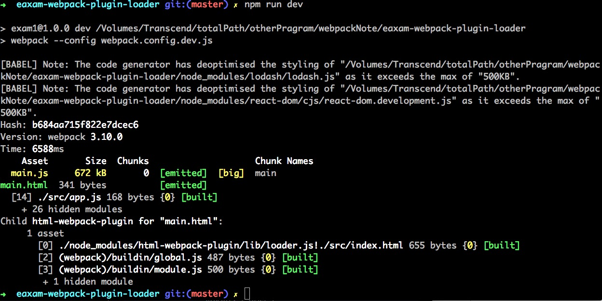

# webpack实用性基础教程 -- webpack-loader
实例通过react来介绍loader的使用。

loader 是webpack用来预处理模块的。  
在一个模块被引用之前，会预先使用loader处理模块内容

## 安装插件

**安装react**
> npm i -D react  
>
> npm i -D react-dom

**安装babel**
> npm i -D babel-core
>
> npm i -D babel-loader
>
> npm i -D babel-preset-react

## `package.json` 插件位置

      {
        "name": "2",
        "version": "1.0.0",
        "description": "",
        "main": "webpack.config.js",
        "scripts": {
          "test": "echo \"Error: no test specified\" && exit 1",
          "dev": "webpack --config webpack.config.dev.js"
        },
        "keywords": [],
        "author": "",
        "license": "ISC",
        "devDependencies": {
          "babel-core": "^6.26.0", //新增
          "babel-loader": "^7.1.2", //新增
          "babel-preset-react": "^6.24.1", //新增
          "html-webpack-plugin": "^2.30.1",
          "webpack": "^3.5.5"
        },
        "dependencies": {
          "react": "^15.6.1", //新增
          "react-dom": "^15.6.1" //新增
        }
      }

## 修改`webpack.config.dev.js` 文件

      const HtmlWebpackPlugin = require('html-webpack-plugin');
      const path = require('path');

      module.exports = {
        entry: './src/app.js',
        output: {
            ...
        },
        plugins: [ 这里存放插件
            ...
        ],
        module: { // 这里存放loader
            rules: [{
                test: /\.js$/,
                use: [{
                    loader: 'babel-loader',  // loader
                    options: {
                        presets: ['react']
                    }
                }]
            }]
        }
      };

## 执行打包命令

> npm run dev

## 执行打包命令

