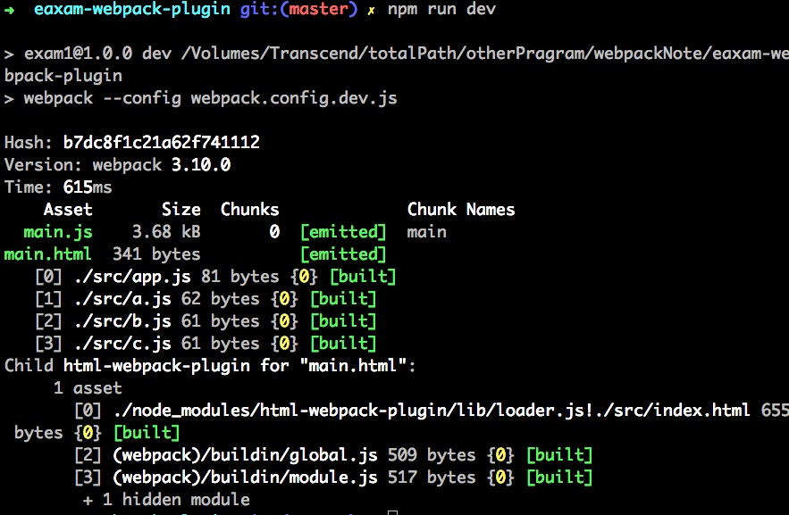

# webpack实用性基础教程 -- webpack-插件
以 html-webpack-plugin 插件为例，讲述插件安装

#### 安装 html-webpack-plugin 插件
> npm install html-webpack-plugin --save-dev

#### `package.json` 插件位置

    {
      "name": "exam1",
      "version": "1.0.0",
      "description": "",
      "main": "webpack.config.js",
      "scripts": {
        "test": "echo \"Error: no test specified\" && exit 1",
        "dev": "webpack --config webpack.config.dev.js"
      },
      "keywords": [],
      "author": "",
      "license": "ISC",
      "devDependencies": {
        "html-webpack-plugin": "^2.30.1", // 安装好的html-webpack-plugin 插件
        "webpack": "^3.10.0"
      }
    }

#### 修改`webpack.config.dev.js` 文件

    const HtmlWebpackPlugin = require('html-webpack-plugin'); // 引用html-webpack-plugin 插件
    const path = require('path');

    module.exports = { // nodeJS 模块化语法
      // 入口文件
      entry : './src/app.js',

      // 输出地方
      output: {
          path: path.resolve(__dirname, 'dist'),
          filename: 'main.js'
      },
      plugins : [ //这里存放插件
          new HtmlWebpackPlugin({ //new 一个HtmlWebpackPlugin实例子
            filename : 'main.html', // 创建文件名称
            template : './src/index.html' //创建文件所依赖的模版
          })
      ]
    }

#### 执行打包命令

> npm run dev

#### 执行结果

