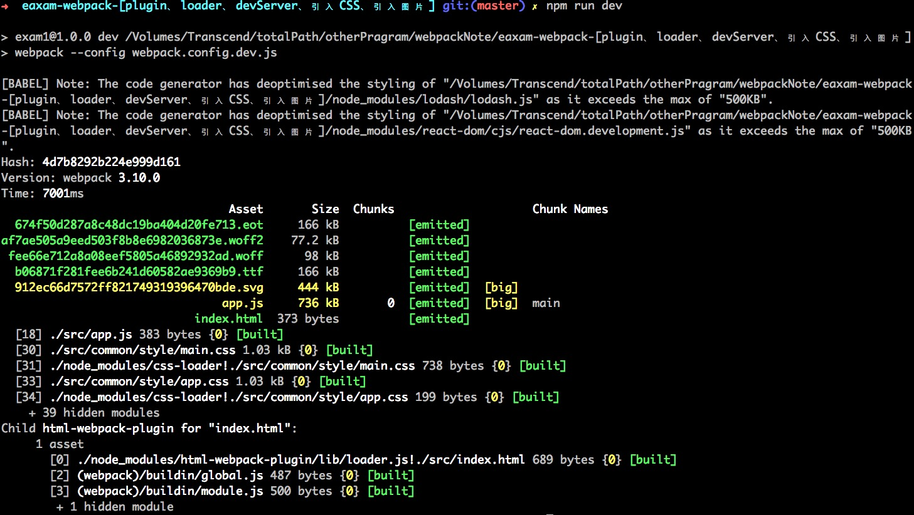

# webpack-输出路径处理

## 使用 clean-webpack-plugin 清除dist文件夹中重复的文件

#### 安装 clean-webpack-plugin 插件
> npm i -D clean-webpack-plugin

#### 修改`webpack.config.dev.js` 文件

      const HtmlWebpackPlugin = require('html-webpack-plugin'); // 引用html-webpack-plugin 插件
      const path = require('path');

      const CleanWebpackPlugin = require('clean-webpack-plugin') //安装clean-webpack-plugin 插件

      module.exports = {  
          // 入口文件
          entry: './src/app.js', // 输出目录

          // 输出地方
          output: {
            path: path.resolve(__dirname, 'dist/assets'),
            filename: 'js/app.js'
          },
          plugins: [  
            new HtmlWebpackPlugin({
              filename: '../index.html', // 路径设置
              template: './src/index.html'
            }),

            new CleanWebpackPlugin (['dist']) // 调用 clean-webpack-plugin 插件
          ],
          module: {
            rules: [
             。。。
             ,
              {
                test: /\.css$/,
                use: [
                  'style-loader', // 第二布 -- 插入样式到结构并插入到body中
                  //'css-loader' // 第一步 -- 解析样式
                  {
                    loader : 'css-loader',
                    options : {
                         modules: true, //开启模块化
                         localIdentName : '[path][name]__[local]--[hash:base64:5]'
                    }
                  }
                ],
                exclude : [
                  path.resolve(__dirname,'node_modules'),
                  path.resolve(__dirname,'src/common')
                ]
              },
              {
                test: /\.css$/,
                use: ['style-loader','css-loader'],
                include : [ // 包含（直解析这里面的文件，其余的CSS模块化处理
                  path.resolve(__dirname,'node_modules'),
                  path.resolve(__dirname,'src/common')
                ]
              },
              {
                test: /\.scss$/,
                use: [
                  'style-loader', // 第二布 -- 插入样式到结构并插入到body中
                  //'css-loader' // 第一步 -- 解析样式
                  {
                    loader : 'css-loader',
                    options : {
                         modules: true, //开启模块化
                         localIdentName : '[path][name]__[local]--[hash:base64:5]'
                    }
                  },
                  'sass-loader'
                ],
                exclude : [//排除某些文件夹（不模块化）
                  path.resolve(__dirname,'node_modules'),
                  path.resolve(__dirname,'src/common')
                ]
              },
              {
                test: /\.scss$/,
                use: ['style-loader','css-loader','sass-loader'],
                include : [ // 包含（直解析这里面的文件，其余的CSS模块化处理
                  path.resolve(__dirname,'node_modules'),
                  path.resolve(__dirname,'src/common')
                ]
              },
              {
                test: /\.less$/,
                use: [
                  'style-loader', // 第二布 -- 插入样式到结构并插入到body中
                  //'css-loader' // 第一步 -- 解析样式
                  {
                    loader : 'css-loader',
                    options : {
                         modules: true, //开启模块化
                         localIdentName : '[path][name]__[local]--[hash:base64:5]'
                    }
                  },
                  'less-loader'
                ],
                exclude : [//排除某些文件夹（不模块化）
                  path.resolve(__dirname,'node_modules'),
                  path.resolve(__dirname,'src/common')
                ]
              },
              {
                test: /\.less$/,
                use: ['style-loader','css-loader','less-loader'],
                include : [ // 包含（直解析这里面的文件，其余的CSS模块化处理
                  path.resolve(__dirname,'node_modules'),
                  path.resolve(__dirname,'src/common')
                ]
              },
              {
                test: /\.(png|jpg|gif)$/,
                use: [{
                    loader: 'url-loader', //把图片转换成base64格式
                    options: {
                      limit: 8192, //以b为单位 1kb = 1000b,大于此体积的会图片打包，否则图片会转换成base64
                      name : 'img/[name]_[hash].[ext]' //修改输出img的文件名
                    }
                  }]
              },
              {
                test: /\.(eot|woff|ttf|svg|woff2)$/,
                use: [{
                  loader : 'file-loader', // 1. 字体移动到打包目录 2. 字体转换成需要的路径，并且重命名
                  options : {
                    name : 'fonts/[name]_[hash].[ext]' //修改输出img的文件名
                  }
                }]
              },
              ]
            },
            。。。
          }

#### 执行打包命令
> npm run dev

#### 执行结果

