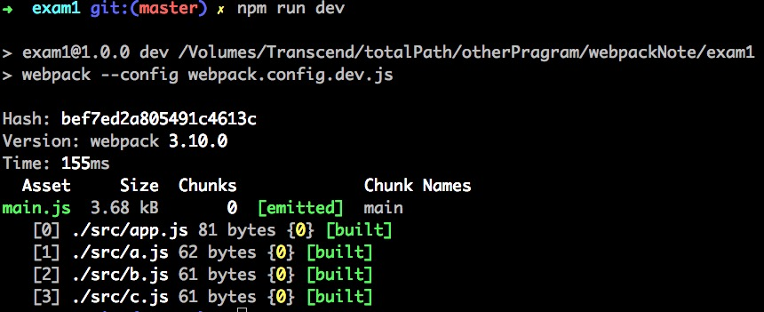

# webpack的基本语法和工作流程

`a.js`

    export default function a() {
        console.log('module a');
    }

`app.js`

    import a from './a';  // 引入模块
    a();

`webpack.config.dev.js`

    const path = require('path');

    module.exports = { // nodeJS 模块化语法
      // 入口文件
      entry : './src/app.js',

      // 输出路径及文件名
      output: {
          path: path.resolve(__dirname, 'dist'),
          filename: 'main.js'
      }
    }

##### 安装npm默认配置
> npm init -y

##### 安装开发依赖
> npm i -D webpack

##### 修改配置文件

    {
      "name": "exam1",
      "version": "1.0.0",
      "description": "",
      "main": "webpack.config.js",
      "scripts": {
        "test": "echo \"Error: no test specified\" && exit 1",

        "dev" : "webpack" //配置执行[npm run dev]命令需要执行的文件，默认为webpack.config.js

      },
      "keywords": [],
      "author": "",
      "license": "ISC",
      "devDependencies": {
        "webpack": "^3.10.0"
      }
    }
#### 执行打包命令

> npm run dev

#### 执行结果

