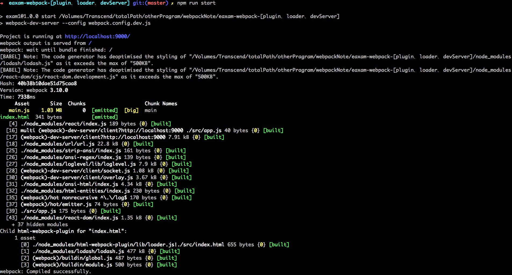

# webpack-引入CSS

css-loader

#### 安装 css-loader 插件
> npm i -D css-loader 

#### 修改`webpack.config.dev.js` 文件

    const HtmlWebpackPlugin = require('html-webpack-plugin'); // 引用html-webpack-plugin 插件
    const path = require('path');

    module.exports = {
      entry: './src/app.js',
      output: {
          ...
      },
      plugins: [ // 这里存放插件
          ...
      ],
      module: { // 这里存放loader
          ...
          ,{ //新增 css-loader 配置
            test: /\.css$/,
            use: [
              'style-loader', // 第二布 -- 插入样式到结构并插入到body中
              'css-loader' // 第一步 -- 解析样式
            ]
          }

      },
      devServer: { // 这里配置webpack-devServer
          ...
      }
    };

#### 修改`app.js`文件

    import React from 'react';
    import ReactDOM from 'react-dom';

    // 引入CSS文件
    import './main.css';
    import './app.css';

    ReactDOM.render(
        
React ussssssd
,
        document.getElementById('root')
    );

#### 执行打包命令

> npm run start

#### 执行结果

