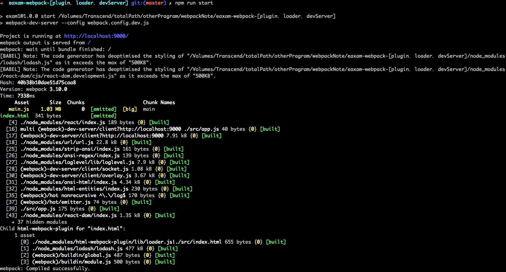

# webpack - 引用图片

## 1. 使用 file-loader 引用图片

#### 安装 webpack-dev-server 插件
> npm i -D file-loader

#### 修改`webpack.config.dev.js` 文件

    const HtmlWebpackPlugin = require('html-webpack-plugin'); // 引用html-webpack-plugin 插件
    const path = require('path');

    module.exports = {
      entry: './src/app.js',
      output: {
          ...
      },
      plugins: [ // 这里存放插件
          ...
      ],
      module: { // 这里存放loader
          ...
          ,{ // 这里配置file-loader
            test: /\.(png|jpg|gif)$/,
            use: [
              'file-loader' // 1. 图片移动到打包目录 2. 图片转换成需要的路径，并且重命名
            ]
          }

      },
      devServer: { // 这里配置webpack-devServer
          ...
      }
    };

#### 修改`app.js`文件

    import React from 'react';
    import ReactDOM from 'react-dom';  

    import './common/style/main.css'; // CSS中引用图片

    import dog from './common/img/dogs.jpg'; // 结构中引用

    ReactDOM.render(
        

        React ussssssd  
          
        
,
        document.getElementById('root')
    );

#### 执行打包命令
> npm run start

#### 执行结果

## 2. 使用 url-loader 引用图片

> url-loader -- 增强型的file-loader

#### 安装 webpack-dev-server 插件
> npm i -D url-loader

#### 修改`webpack.config.dev.js` 文件

    const HtmlWebpackPlugin = require('html-webpack-plugin'); // 引用html-webpack-plugin 插件
    const path = require('path');

    module.exports = {
      entry: './src/app.js',
      output: {
          ...
      },
      plugins: [ // 这里存放插件
          ...
      ],
      module: { // 这里存放loader
          ...
          ,
          {
            test: /\.(png|jpg|gif)$/,
            use: [{
                loader: 'url-loader', //把图片转换成base64格式
                options: {
                  limit: 8192 //以b为单位 1kb = 1000b,大于此体积的会图片打包，否则图片会转换成base64
                }
              }]
          }
      },
      devServer: { // 这里配置webpack-devServer
          ...
      }
    };

#### 修改`app.js`文件

    import React from 'react';
    import ReactDOM from 'react-dom';
    import './common/style/main.css';
    import './common/style/app.css';

    import dog from './common/img/dogs.jpg';
    import kb3 from './common/img/3kb.jpg';
    const giphy = require('./common/img/giphy.gif');

    ReactDOM.render(
        

        React ussssssde  
           
           
           
           
        
,
        document.getElementById('root')
    );

#### 执行打包命令
> npm run start

#### 执行结果

